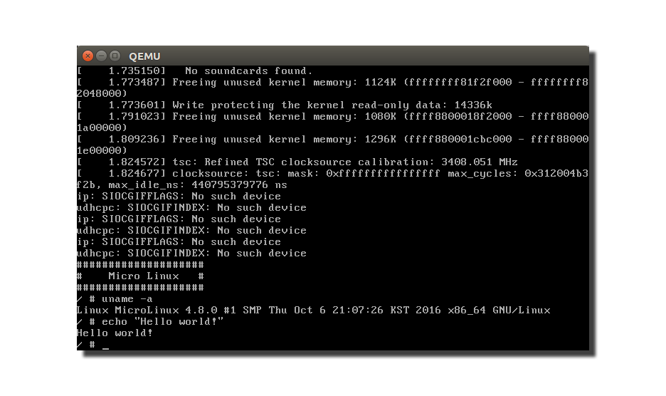

How to Make a Micro Linux
=======================================

이 문서는 [Busybox](https://www.busybox.net)를 사용하여 작은 리눅스 시스템을 만드는 방법 설명하고 있습니다.

**소스 코드**: 소스 코드는 [src](https://github.com/LeeKyuHyuk/How-to-Make-a-Micro-Linux/tree/master/src) 폴더에 있습니다. 각 단계는 다른 관련 파일에 대한 링크가 포함됩니다.

**기여하기**: 이 강좌는 누구나 참여가 가능합니다. 이 문서에 문제가 있다면 pull-request 해주시기 바랍니다.

